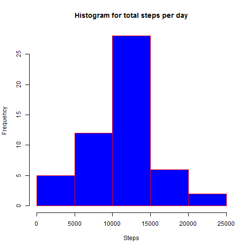
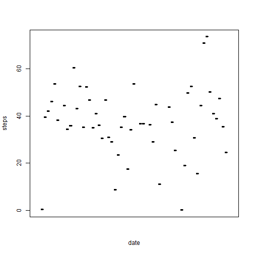
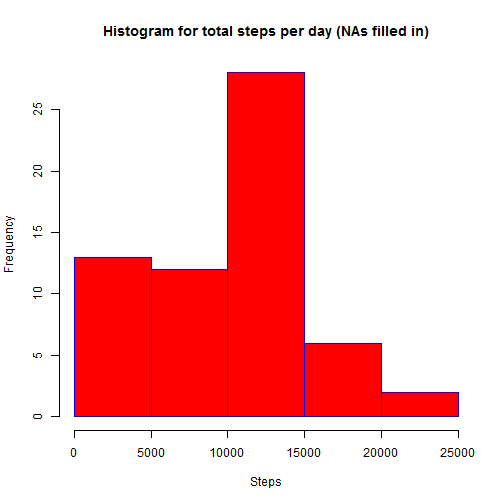
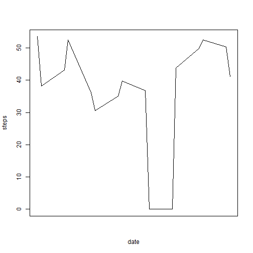

##**Loading and preprocessing the data**
**This section will present step by step solution for this part.  
First, load the data and display a few entries**


```r
activityData<-read.csv("activity.csv")
head(activityData)
```

```
##   steps       date interval
## 1    NA 2012-10-01        0
## 2    NA 2012-10-01        5
## 3    NA 2012-10-01       10
## 4    NA 2012-10-01       15
## 5    NA 2012-10-01       20
## 6    NA 2012-10-01       25
```

**Next step is to clean the data (removing the NAs) ** 

```r
cleanActivityData <- activityData[complete.cases(activityData),]
head(cleanActivityData)
```

```
##     steps       date interval
## 289     0 2012-10-02        0
## 290     0 2012-10-02        5
## 291     0 2012-10-02       10
## 292     0 2012-10-02       15
## 293     0 2012-10-02       20
## 294     0 2012-10-02       25
```
**At this point we have two dataframes containing the data to be further processed.**  

```r
str(activityData)
```

```
## 'data.frame':	17568 obs. of  3 variables:
##  $ steps   : int  NA NA NA NA NA NA NA NA NA NA ...
##  $ date    : Factor w/ 61 levels "2012-10-01","2012-10-02",..: 1 1 1 1 1 1 1 1 1 1 ...
##  $ interval: int  0 5 10 15 20 25 30 35 40 45 ...
```

```r
str(cleanActivityData)
```

```
## 'data.frame':	15264 obs. of  3 variables:
##  $ steps   : int  0 0 0 0 0 0 0 0 0 0 ...
##  $ date    : Factor w/ 61 levels "2012-10-01","2012-10-02",..: 2 2 2 2 2 2 2 2 2 2 ...
##  $ interval: int  0 5 10 15 20 25 30 35 40 45 ...
```


##**What is mean total number of steps taken per day?**
**The next part presents the step by step solution for the second section. **


**Calculate the total number of steps taken per day**

```r
totalStepsPerDay <-aggregate(steps~date, data = cleanActivityData, sum)
```
  
  
  
**Now let's create a histogram for this data**

```r
hist(totalStepsPerDay$steps, plot = TRUE, main="Histogram for total steps per day", 
     xlab="Steps", 
     border="red", 
     col="blue",
     breaks=5)
```

 

**Calculate the mean number of steps per day and report findings**  

```r
meanStepsPerDay <- aggregate(steps~date, data = cleanActivityData, mean)
library(knitr)
kable(meanStepsPerDay, format = "markdown")
```


|date       |      steps|
|:----------|----------:|
|2012-10-02 |  0.4375000|
|2012-10-03 | 39.4166667|
|2012-10-04 | 42.0694444|
|2012-10-05 | 46.1597222|
|2012-10-06 | 53.5416667|
|2012-10-07 | 38.2465278|
|2012-10-09 | 44.4826389|
|2012-10-10 | 34.3750000|
|2012-10-11 | 35.7777778|
|2012-10-12 | 60.3541667|
|2012-10-13 | 43.1458333|
|2012-10-14 | 52.4236111|
|2012-10-15 | 35.2048611|
|2012-10-16 | 52.3750000|
|2012-10-17 | 46.7083333|
|2012-10-18 | 34.9166667|
|2012-10-19 | 41.0729167|
|2012-10-20 | 36.0937500|
|2012-10-21 | 30.6284722|
|2012-10-22 | 46.7361111|
|2012-10-23 | 30.9652778|
|2012-10-24 | 29.0104167|
|2012-10-25 |  8.6527778|
|2012-10-26 | 23.5347222|
|2012-10-27 | 35.1354167|
|2012-10-28 | 39.7847222|
|2012-10-29 | 17.4236111|
|2012-10-30 | 34.0937500|
|2012-10-31 | 53.5208333|
|2012-11-02 | 36.8055556|
|2012-11-03 | 36.7048611|
|2012-11-05 | 36.2465278|
|2012-11-06 | 28.9375000|
|2012-11-07 | 44.7326389|
|2012-11-08 | 11.1770833|
|2012-11-11 | 43.7777778|
|2012-11-12 | 37.3784722|
|2012-11-13 | 25.4722222|
|2012-11-15 |  0.1423611|
|2012-11-16 | 18.8923611|
|2012-11-17 | 49.7881944|
|2012-11-18 | 52.4652778|
|2012-11-19 | 30.6979167|
|2012-11-20 | 15.5277778|
|2012-11-21 | 44.3993056|
|2012-11-22 | 70.9270833|
|2012-11-23 | 73.5902778|
|2012-11-24 | 50.2708333|
|2012-11-25 | 41.0902778|
|2012-11-26 | 38.7569444|
|2012-11-27 | 47.3819444|
|2012-11-28 | 35.3576389|
|2012-11-29 | 24.4687500|


**Calculate the median number of steps per day**  

```r
medianStepsPerDay <- aggregate(steps~date, data = cleanActivityData, median)
kable(medianStepsPerDay, format = "markdown")
```


|date       | steps|
|:----------|-----:|
|2012-10-02 |     0|
|2012-10-03 |     0|
|2012-10-04 |     0|
|2012-10-05 |     0|
|2012-10-06 |     0|
|2012-10-07 |     0|
|2012-10-09 |     0|
|2012-10-10 |     0|
|2012-10-11 |     0|
|2012-10-12 |     0|
|2012-10-13 |     0|
|2012-10-14 |     0|
|2012-10-15 |     0|
|2012-10-16 |     0|
|2012-10-17 |     0|
|2012-10-18 |     0|
|2012-10-19 |     0|
|2012-10-20 |     0|
|2012-10-21 |     0|
|2012-10-22 |     0|
|2012-10-23 |     0|
|2012-10-24 |     0|
|2012-10-25 |     0|
|2012-10-26 |     0|
|2012-10-27 |     0|
|2012-10-28 |     0|
|2012-10-29 |     0|
|2012-10-30 |     0|
|2012-10-31 |     0|
|2012-11-02 |     0|
|2012-11-03 |     0|
|2012-11-05 |     0|
|2012-11-06 |     0|
|2012-11-07 |     0|
|2012-11-08 |     0|
|2012-11-11 |     0|
|2012-11-12 |     0|
|2012-11-13 |     0|
|2012-11-15 |     0|
|2012-11-16 |     0|
|2012-11-17 |     0|
|2012-11-18 |     0|
|2012-11-19 |     0|
|2012-11-20 |     0|
|2012-11-21 |     0|
|2012-11-22 |     0|
|2012-11-23 |     0|
|2012-11-24 |     0|
|2012-11-25 |     0|
|2012-11-26 |     0|
|2012-11-27 |     0|
|2012-11-28 |     0|
|2012-11-29 |     0|

##**What is the average daily activity pattern?**

**Make a time series plot (i.e. type = "l") of the 5-minute interval (x-axis) and the average number of steps taken, averaged across all days (y-axis)**


```r
plot(steps~date, meanStepsPerDay, xaxt = "n", type = "l")
```

 

##**Imputing missing values**
**Calculate and report the total number of missing values in the dataset (i.e. the total number of rows with NAs)**

Note that the `echo = FALSE` parameter was added to the code chunk to prevent printing of the R code that generated the plot.

```r
numeberOfNARows <- nrow(activityData) - nrow(cleanActivityData)
cat(sprintf("Number of rows with NA steps: %d\n", numeberOfNARows ))
```

```
## Number of rows with NA steps: 2304
```
**Devise a strategy for filling in all of the missing values in the dataset. The strategy does not need to be sophisticated. For example, you could use the mean/median for that day, or the mean for that 5-minute interval, etc.**  
Solution: one strategy to fill in for the missing values (NAs) will be to replace NAs with 0 steps.

**Create a new dataset that is equal to the original dataset but with the missing data filled in.**


```r
filledActivityData <- activityData
filledActivityData["steps"][is.na(filledActivityData["steps"])]<-0
head(filledActivityData)
```

```
##   steps       date interval
## 1     0 2012-10-01        0
## 2     0 2012-10-01        5
## 3     0 2012-10-01       10
## 4     0 2012-10-01       15
## 5     0 2012-10-01       20
## 6     0 2012-10-01       25
```

**Make a histogram of the total number of steps taken each day and Calculate and report the mean and median total number of steps taken per day. Do these values differ from the estimates from the first part of the assignment? What is the impact of imputing missing data on the estimates of the total daily number of steps?**

Here we will redo the previous calculations using the filled in for NAs activity data


**Calculate the total number of steps taken per day**

```r
totalStepsPerDay2 <-aggregate(steps~date, data = filledActivityData, sum)
```
  
  
  
**The histogram for this new data**

```r
hist(totalStepsPerDay2$steps, plot = TRUE, main="Histogram for total steps per day (NAs filled in)", 
     xlab="Steps", 
     border="blue", 
     col="red",
     breaks=5)
```

 

**Calculate the mean number of steps per day and report findings**  

```r
meanStepsPerDay2 <- aggregate(steps~date, data = totalStepsPerDay2, mean)
library(knitr)
kable(meanStepsPerDay, format = "markdown")
```


|date       |      steps|
|:----------|----------:|
|2012-10-02 |  0.4375000|
|2012-10-03 | 39.4166667|
|2012-10-04 | 42.0694444|
|2012-10-05 | 46.1597222|
|2012-10-06 | 53.5416667|
|2012-10-07 | 38.2465278|
|2012-10-09 | 44.4826389|
|2012-10-10 | 34.3750000|
|2012-10-11 | 35.7777778|
|2012-10-12 | 60.3541667|
|2012-10-13 | 43.1458333|
|2012-10-14 | 52.4236111|
|2012-10-15 | 35.2048611|
|2012-10-16 | 52.3750000|
|2012-10-17 | 46.7083333|
|2012-10-18 | 34.9166667|
|2012-10-19 | 41.0729167|
|2012-10-20 | 36.0937500|
|2012-10-21 | 30.6284722|
|2012-10-22 | 46.7361111|
|2012-10-23 | 30.9652778|
|2012-10-24 | 29.0104167|
|2012-10-25 |  8.6527778|
|2012-10-26 | 23.5347222|
|2012-10-27 | 35.1354167|
|2012-10-28 | 39.7847222|
|2012-10-29 | 17.4236111|
|2012-10-30 | 34.0937500|
|2012-10-31 | 53.5208333|
|2012-11-02 | 36.8055556|
|2012-11-03 | 36.7048611|
|2012-11-05 | 36.2465278|
|2012-11-06 | 28.9375000|
|2012-11-07 | 44.7326389|
|2012-11-08 | 11.1770833|
|2012-11-11 | 43.7777778|
|2012-11-12 | 37.3784722|
|2012-11-13 | 25.4722222|
|2012-11-15 |  0.1423611|
|2012-11-16 | 18.8923611|
|2012-11-17 | 49.7881944|
|2012-11-18 | 52.4652778|
|2012-11-19 | 30.6979167|
|2012-11-20 | 15.5277778|
|2012-11-21 | 44.3993056|
|2012-11-22 | 70.9270833|
|2012-11-23 | 73.5902778|
|2012-11-24 | 50.2708333|
|2012-11-25 | 41.0902778|
|2012-11-26 | 38.7569444|
|2012-11-27 | 47.3819444|
|2012-11-28 | 35.3576389|
|2012-11-29 | 24.4687500|


**Calculate the median number of steps per day**  

```r
medianStepsPerDay2 <- aggregate(steps~date, data = totalStepsPerDay2, median)
kable(medianStepsPerDay, format = "markdown")
```


|date       | steps|
|:----------|-----:|
|2012-10-02 |     0|
|2012-10-03 |     0|
|2012-10-04 |     0|
|2012-10-05 |     0|
|2012-10-06 |     0|
|2012-10-07 |     0|
|2012-10-09 |     0|
|2012-10-10 |     0|
|2012-10-11 |     0|
|2012-10-12 |     0|
|2012-10-13 |     0|
|2012-10-14 |     0|
|2012-10-15 |     0|
|2012-10-16 |     0|
|2012-10-17 |     0|
|2012-10-18 |     0|
|2012-10-19 |     0|
|2012-10-20 |     0|
|2012-10-21 |     0|
|2012-10-22 |     0|
|2012-10-23 |     0|
|2012-10-24 |     0|
|2012-10-25 |     0|
|2012-10-26 |     0|
|2012-10-27 |     0|
|2012-10-28 |     0|
|2012-10-29 |     0|
|2012-10-30 |     0|
|2012-10-31 |     0|
|2012-11-02 |     0|
|2012-11-03 |     0|
|2012-11-05 |     0|
|2012-11-06 |     0|
|2012-11-07 |     0|
|2012-11-08 |     0|
|2012-11-11 |     0|
|2012-11-12 |     0|
|2012-11-13 |     0|
|2012-11-15 |     0|
|2012-11-16 |     0|
|2012-11-17 |     0|
|2012-11-18 |     0|
|2012-11-19 |     0|
|2012-11-20 |     0|
|2012-11-21 |     0|
|2012-11-22 |     0|
|2012-11-23 |     0|
|2012-11-24 |     0|
|2012-11-25 |     0|
|2012-11-26 |     0|
|2012-11-27 |     0|
|2012-11-28 |     0|
|2012-11-29 |     0|

##**Are there differences in activity patterns between weekdays and weekends?**

**Create a new factor variable in the dataset with two levels - "weekday" and "weekend" indicating whether a given date is a weekday or weekend day.**

```r
filledActivityData2 <- filledActivityData
filledActivityData2$date <- as.Date(filledActivityData2$date)
filledActivityData2$weekend <- chron::is.weekend(filledActivityData2$date)
head(filledActivityData2)
```

```
##   steps       date interval weekend
## 1     0 2012-10-01        0   FALSE
## 2     0 2012-10-01        5   FALSE
## 3     0 2012-10-01       10   FALSE
## 4     0 2012-10-01       15   FALSE
## 5     0 2012-10-01       20   FALSE
## 6     0 2012-10-01       25   FALSE
```

**Make a panel plot containing a time series plot (i.e. type = "l") of the 5-minute interval (x-axis) and the average number of steps taken, averaged across all weekday days or weekend days (y-axis). See the README file in the GitHub repository to see an example of what this plot should look like using simulated data.**

Weekend


```r
meanWeekendStepsPerDay <- aggregate(steps~date, data = filledActivityData2[filledActivityData2$weekend == TRUE,], mean)
plot(steps~date, meanWeekendStepsPerDay, xaxt = "n", type = "l")
```

 

Week days


```r
meanWeekStepsPerDay <- aggregate(steps~date, data = filledActivityData2[filledActivityData2$weekend == FALSE,], mean)
plot(steps~date, meanWeekStepsPerDay, xaxt = "n", type = "l")
```

 


